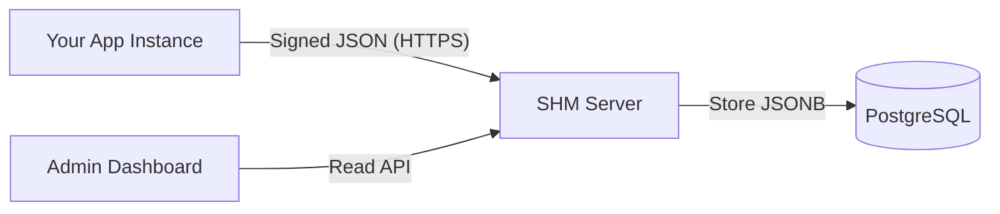

# 🛡️ SHM (Self-Hosted Metrics)

<div align="center">


**Privacy-first, Agnostic Telemetry for Self-Hosted Software.**
Collect usage stats, verify active instances, and understand your user base without spying on them.

[Features](#-features) • [Quick Start](#-quick-start) • [SDK Integration](#-sdk-integration) • [Architecture](#-architecture)

</div>

---

## 🖼️ Dashboard Preview


*Modern, dark-mode dashboard showing aggregated business metrics and system health.*

---

## 🚀 Why SHM?

When you distribute self-hosted software (on-premise), you fly blind. You don't know how many instances are running, which versions are active, or if your features are actually used.

**SHM** solves this with a lightweight, secure approach:
1.  **Privacy First:** Collects aggregate counters, never user content.
2.  **Agnostic:** Send *any* JSON payload. The dashboard adapts automatically.
3.  **Secure:** Every request is signed with an **Ed25519** keypair generated on the client.
4.  **Zero-Config Dashboard:** Single Go binary with embedded UI. No frontend build required.

---

## ✨ Features

- **🔐 Cryptographic Identity:** Instances generate a unique ID and keypair. No spoofing possible.
- **📦 Multi-App Support:** Track multiple software products on a single SHM server.
- **🎨 Dynamic Dashboard:** Send `{"pizzas_eaten": 10}` and SHM automatically creates the KPI cards and table columns.
- **⚙️ Ops vs Business Separation:** Automatically distinguishes between business metrics (KPIs) and system metrics (CPU, RAM, OS).
- **🐳 Docker Native:** Runs anywhere with a simple `docker-compose`.

---

## ⚡ Quick Start (Server)

Docker: 

```docker pull ghcr.io/btouchard/shm:latest```

Get the server running in 30 seconds.

### 1. Create a `compose.yml`

```yaml
services:
  shm:
    image: ghcr.io/btouchard/shm:latest # (Or build locally)
    ports:
      - "8080:8080"
    environment:
      - DATABASE_URL=postgres://user:pass@db:5432/shm?sslmode=disable
    depends_on:
      - db

  db:
    image: postgres:15-alpine
    environment:
      POSTGRES_USER: user
      POSTGRES_PASSWORD: pass
      POSTGRES_DB: shm
    volumes:
      - shm_data:/var/lib/postgresql/data

volumes:
  shm_data:
```

### 2. Run it

```bash
docker compose up -d
```

Access the dashboard at **http://localhost:8080**.

---

## 📦 SDK Integration (Go)

Embed the telemetry client into your application.

```bash
go get github.com/btouchard/shm/sdk
```

### Implementation Example

```go
package main

import (
    "github.com/btouchard/shm/sdk"
)

func main() {
    // 1. Configure the client
    telemetry, err := sdk.New(sdk.Config{
        ServerURL:      "https://metrics.your-domain.com",
        AppName:        "MyAwesomeApp",
        AppVersion:     "1.0.0",
        Environment:    "production",
        DeploymentMode: "docker",
        Enabled:        true,
    })
    
    if err != nil {
        panic(err)
    }

    // 2. Define your metrics (Callback)
    // This runs every hour (configurable)
    telemetry.SetProvider(func() map[string]interface{} {
        // Fetch your DB stats here
        return map[string]interface{}{
            "documents_created": db.CountDocs(),     // Business Metric
            "users_active":      db.CountActive(),   // Business Metric
            "jobs_processed":    worker.TotalJobs(), // Business Metric
        }
    })

    // 3. Start in background
    // SHM automatically adds System metrics (CPU, RAM, OS, Arch...)
    go telemetry.Start(context.Background())
    
    // ... run your app
}
```

---

## 🏗️ Architecture

The system is designed to be as simple as possible to maintain.



1.  **Client:** Generates Ed25519 keys on first run. Stores identity in `metrics_identity.json`.
2.  **Protocol:** Sends a Heartbeat/Snapshot signed with the private key.
3.  **Storage:** PostgreSQL stores the raw JSON payload in a `jsonb` column.
4.  **UI:** The server parses the JSON keys dynamically to build the table and graphs.

---

## 🛡️ Security & Privacy

*   **No PII:** We do not collect IP addresses (unless you configure your reverse proxy to log them), hostnames, or usernames.
*   **Authentication:** The server uses a "Trust on First Use" (TOFU) or explicit activation model. Once an ID is registered with a Public Key, only that key can sign updates.
*   **Transparency:** You should always inform your users that telemetry is active and allow them to opt-out via the `Enabled: false` config.

---

## 🤝 Contributing

Contributions are welcome! Please read the contributing guidelines first.

1.  Fork it
2.  Create your feature branch (`git checkout -b feature/amazing-feature`)
3.  Commit your changes (`git commit -m 'Add some amazing feature'`)
4.  Push to the branch (`git push origin feature/amazing-feature`)
5.  Open a Pull Request

---

## 📄 License

Distributed under the **AGPLv3** License. See `LICENSE` for more information.

The SDK (in the `/sdk` subdirectory) is distributed under the **MIT License** for easier integration into your projects.

---

<div align="center">
  <sub>Built with ❤️ by <a href="https://github.com/btouchard">btouchard</a> using Go, AlpineJS & Tailwind.</sub>
</div>