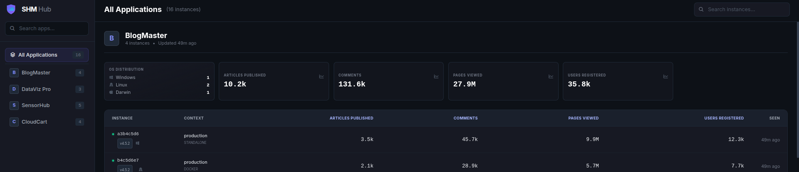
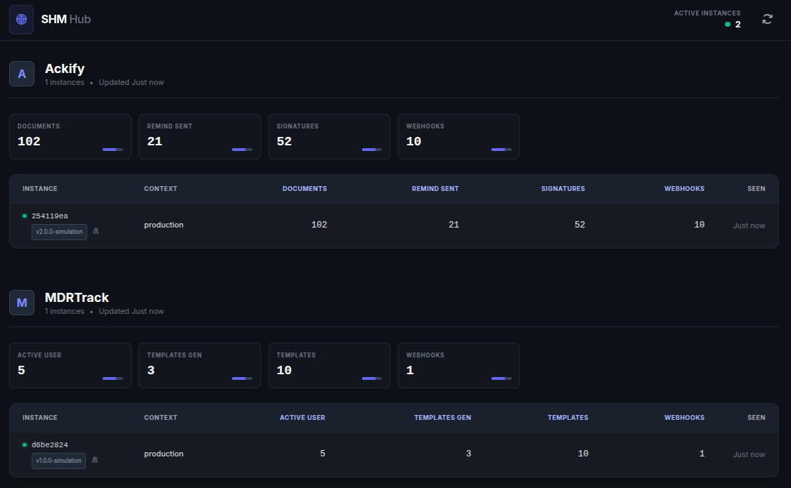
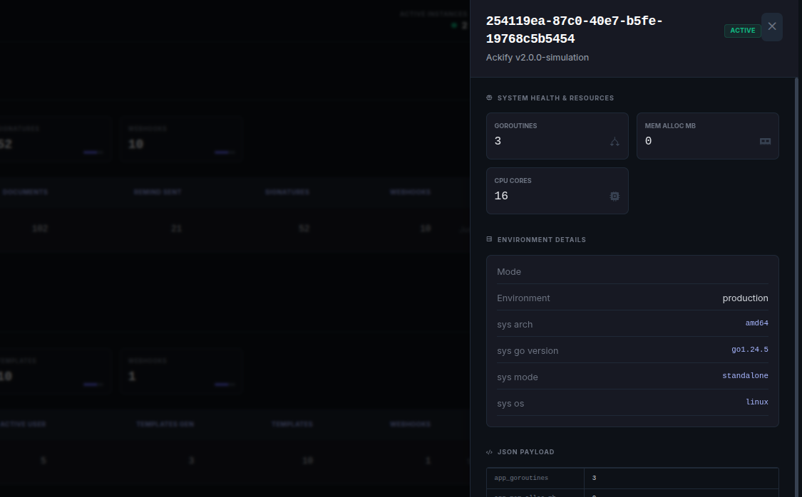
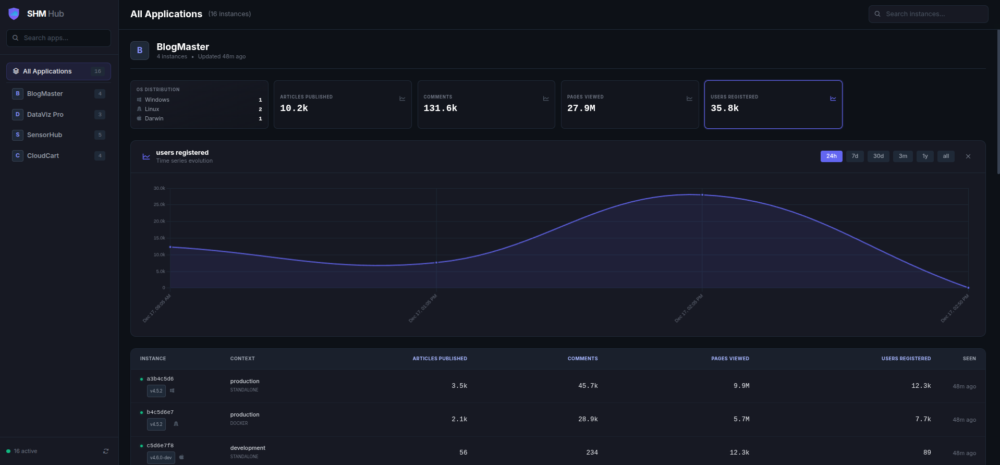
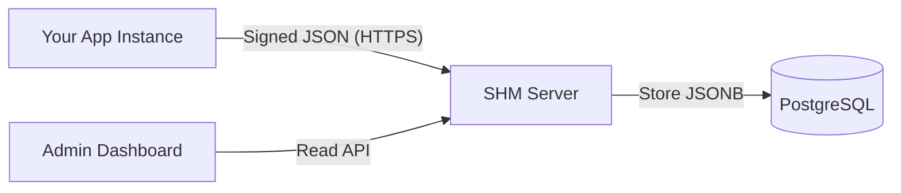

#  Self-Hosted Metrics (SHM)

<div align="center">


**Privacy-first, Agnostic Telemetry for Self-Hosted Software.**
Collect usage stats, verify active instances, and understand your user base without spying on them.

[Features](#-features) • [Quick Start](#-quick-start) • [SDK Integration](#-sdk-integration) • [Architecture](#-architecture)

</div>

---

## 🖼️ Dashboard Preview


*Modern, dark-mode dashboard showing aggregated business metrics and system health.*

---

## 🚀 Why SHM?

When you distribute self-hosted software (on-premise), you fly blind. You don't know how many instances are running, which versions are active, or if your features are actually used.

**SHM** solves this with a lightweight, secure approach:
1.  **Privacy First:** Collects aggregate counters, never user content.
2.  **Agnostic:** Send *any* JSON payload. The dashboard adapts automatically.
3.  **Secure:** Every request is signed with an **Ed25519** keypair generated on the client.
4.  **Zero-Config Dashboard:** Single Go binary with embedded UI. No frontend build required.

---

## ✨ Features

- **🔐 Cryptographic Identity:** Instances generate a unique ID and keypair. No spoofing possible.
- **📦 Multi-App Support:** Track multiple software products on a single SHM server.
- **⭐ GitHub Stars:** Automatically fetch and display GitHub repository stars for your applications.
- **🎨 Dynamic Dashboard:** Send `{"pizzas_eaten": 10}` and SHM automatically creates the KPI cards and table columns.
- **⚙️ Ops vs Business Separation:** Automatically distinguishes between business metrics (KPIs) and system metrics (CPU, RAM, OS).
- **🐳 Docker Native:** Runs anywhere with a simple `docker-compose`.

---

## 🎖️ Public Badges

Display your SHM metrics in your README with embeddable SVG badges.

### Available Badges

#### Active Instances


```markdown

```

#### Most Used Version


```markdown

```

#### Aggregated Metrics


```markdown

```

#### Combined Stats


```markdown

```

### Customization

All badges support query parameters for customization:

- `?color=00D084` - Custom hex color (without #)
- `?label=custom` - Custom label text

Example:
```markdown

```

**Note:** Replace `your-shm-server.example.com` with your actual SHM server URL and `your-app` with your application slug.

---

<table>
  <tr>
    <td align="center">
      <a href="./docs/images/dashboard.png">
        
      </a>
      <br><em>Dashboard</em>
    </td>
    <td align="center">
      <a href="./docs/images/details.png">
        
      </a>
      <br><em>Details</em>
    </td>
    <td align="center">
      <a href="./docs/images/graph.png">
        
      </a>
      <br><em>Graph</em>
    </td>
  </tr>
</table>

---

## ⚡ Quick Start (Server)

### 1. Create the configuration

Create a `compose.yml` file:

```yaml
name: shm

services:
  db:
    image: postgres:15-alpine
    container_name: shm-db
    restart: unless-stopped
    environment:
      POSTGRES_USER: shm
      POSTGRES_PASSWORD: ${DB_PASSWORD:-change-me-in-production}
      POSTGRES_DB: metrics
    volumes:
      - postgres_data:/var/lib/postgresql/data
      - ./migrations:/docker-entrypoint-initdb.d
    healthcheck:
      test: ["CMD-SHELL", "pg_isready -U shm -d metrics"]
      interval: 10s
      timeout: 5s
      retries: 5

  app:
    image: ghcr.io/btouchard/shm:latest
    # Or build from source:
    # build:
    #   context: .
    #   dockerfile: Dockerfile
    container_name: shm-app
    restart: unless-stopped
    depends_on:
      db:
        condition: service_healthy
    environment:
      SHM_DB_DSN: "postgres://shm:${DB_PASSWORD:-change-me-in-production}@db:5432/metrics?sslmode=disable"
      PORT: "8080"
    ports:
      - "8080:8080"

volumes:
  postgres_data:
```

### 2. Download migrations

```bash
mkdir -p migrations
curl -sL https://raw.githubusercontent.com/btouchard/shm/main/migrations/001_init.sql -o migrations/001_init.sql
curl -sL https://raw.githubusercontent.com/btouchard/shm/main/migrations/002_applications.sql -o migrations/002_applications.sql
```

### 3. Start the services

```bash
docker compose up -d
```

Access the dashboard at **http://localhost:8080**.

### Environment Variables

#### Core Settings

| Variable | Default | Description |
|----------|---------|-------------|
| `SHM_DB_DSN` | (required) | PostgreSQL connection string |
| `PORT` | `8080` | HTTP server port |
| `GITHUB_TOKEN` | - | GitHub Personal Access Token for higher API rate limits (5000 req/h instead of 60 req/h) |

#### Rate Limiting

Rate limiting is enabled by default to protect against abuse.

| Variable | Default | Description |
|----------|---------|-------------|
| `SHM_RATELIMIT_ENABLED` | `true` | Enable/disable rate limiting |
| `SHM_RATELIMIT_CLEANUP_INTERVAL` | `10m` | Interval for cleaning up expired limiters |
| `SHM_RATELIMIT_REGISTER_REQUESTS` | `5` | Max requests per period for `/v1/register` and `/v1/activate` |
| `SHM_RATELIMIT_REGISTER_PERIOD` | `1m` | Time window for register endpoints |
| `SHM_RATELIMIT_REGISTER_BURST` | `2` | Burst allowance for register endpoints |
| `SHM_RATELIMIT_SNAPSHOT_REQUESTS` | `1` | Max requests per period for `/v1/snapshot` (per instance) |
| `SHM_RATELIMIT_SNAPSHOT_PERIOD` | `1m` | Time window for snapshot endpoint |
| `SHM_RATELIMIT_SNAPSHOT_BURST` | `2` | Burst allowance for snapshot endpoint |
| `SHM_RATELIMIT_ADMIN_REQUESTS` | `30` | Max requests per period for `/api/v1/admin/*` |
| `SHM_RATELIMIT_ADMIN_PERIOD` | `1m` | Time window for admin endpoints |
| `SHM_RATELIMIT_ADMIN_BURST` | `10` | Burst allowance for admin endpoints |
| `SHM_RATELIMIT_BRUTEFORCE_THRESHOLD` | `5` | Failed auth attempts before IP ban |
| `SHM_RATELIMIT_BRUTEFORCE_BAN` | `15m` | Duration of IP ban after brute-force detection |

See [docs/DEPLOYMENT.md](./docs/DEPLOYMENT.md) for deployment examples and security configuration.

---

## 📦 SDK Integration (Go)

Embed the telemetry client into your application.

```bash
go get github.com/btouchard/shm/sdk
```

### Implementation Example

```go
package main

import (
    "github.com/btouchard/shm/sdk"
)

func main() {
    // 1. Configure the client
    telemetry, err := sdk.New(sdk.Config{
        ServerURL:      "https://metrics.your-domain.com",
        AppName:        "MyAwesomeApp",
        AppVersion:     "1.0.0",
        Environment:    "production",
        Enabled:        true,
    })
    
    if err != nil {
        panic(err)
    }

    // 2. Define your metrics (Callback)
    // This runs every hour (configurable)
    telemetry.SetProvider(func() map[string]interface{} {
        // Fetch your DB stats here
        return map[string]interface{}{
            "documents_created": db.CountDocs(),     // Business Metric
            "users_active":      db.CountActive(),   // Business Metric
            "jobs_processed":    worker.TotalJobs(), // Business Metric
        }
    })

    // 3. Start in background
    // SHM automatically adds System metrics (CPU, RAM, OS, Arch...)
    go telemetry.Start(context.Background())

    // ... run your app
}
```

---

## 📦 SDK Integration (Node.js / TypeScript)

Embed the telemetry client into your Node.js application.

[](https://www.npmjs.com/package/@btouchard/shm-sdk)

```bash
npm install @btouchard/shm-sdk
```

### Implementation Example

```typescript
import { SHMClient } from '@btouchard/shm-sdk';

// 1. Configure the client
const telemetry = new SHMClient({
    serverUrl: 'https://metrics.your-domain.com',
    appName: 'MyAwesomeApp',
    appVersion: '1.0.0',
    environment: 'production',
    enabled: true,
});

// 2. Define your metrics (Callback)
// This runs every hour (configurable)
telemetry.setProvider(() => ({
    documents_created: db.countDocs(),     // Business Metric
    users_active: db.countActive(),        // Business Metric
    jobs_processed: worker.totalJobs(),    // Business Metric
}));

// 3. Start in background
// SHM automatically adds System metrics (CPU, RAM, OS, Arch...)
const controller = telemetry.start();

// To stop later:
// controller.abort();
```

> **Note:** Requires Node.js >= 22 LTS. Zero external dependencies.

---

## 🏗️ Architecture

The system is designed to be as simple as possible to maintain.



1.  **Client:** Generates Ed25519 keys on first run. Stores identity in `metrics_identity.json`.
2.  **Protocol:** Sends a Heartbeat/Snapshot signed with the private key.
3.  **Storage:** PostgreSQL stores the raw JSON payload in a `jsonb` column.
4.  **UI:** The server parses the JSON keys dynamically to build the table and graphs.

---

## 🛡️ Security & Privacy

*   **No PII:** We do not collect IP addresses (unless you configure your reverse proxy to log them), hostnames, or usernames.
*   **Authentication:** The server uses a "Trust on First Use" (TOFU) or explicit activation model. Once an ID is registered with a Public Key, only that key can sign updates.
*   **Transparency:** You should always inform your users that telemetry is active and allow them to opt-out via the `Enabled: false` config.

---

## 🤝 Contributing

Contributions are welcome! Please read the contributing guidelines first.

1.  Fork it
2.  Create your feature branch (`git checkout -b feature/amazing-feature`)
3.  Commit your changes (`git commit -m 'Add some amazing feature'`)
4.  Push to the branch (`git push origin feature/amazing-feature`)
5.  Open a Pull Request

---

## 📄 License

Distributed under the **AGPLv3** License. See `LICENSE` for more information.

The SDK (in the `/sdk` subdirectory) is distributed under the **MIT License** for easier integration into your projects.

---

<div align="center">
  <sub>Built with ❤️ by <a href="https://github.com/btouchard">btouchard</a> using Go, AlpineJS & Tailwind.</sub>
</div>